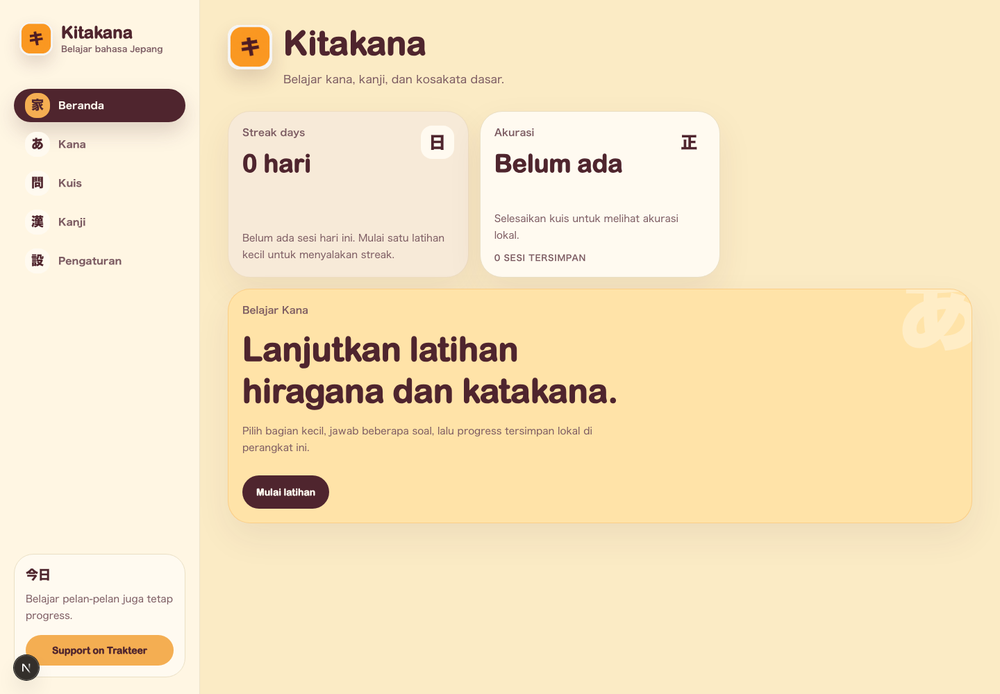
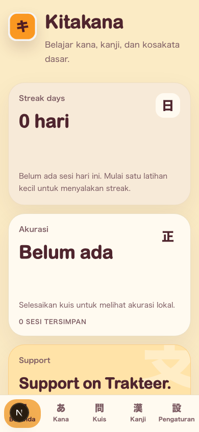

# Kitakana

[](LICENSE)


Kitakana is an open-source Japanese learning PWA built for the browser. It currently helps beginners practice hiragana, katakana, kana quizzes, JLPT N5 kanji, learning preferences, and local progress without requiring an account.

This README follows the documentation structure recommended by [Make a README](https://www.makeareadme.com/): description, visuals, installation, usage, support, roadmap, contributing, project status, and license.

## App Documentation

### Desktop



### Mobile



## Features

- Complete hiragana and katakana charts with romaji.
- Interactive kana practice.
- Quick kana quiz sessions.
- JLPT N5 kanji content with meanings, readings, stroke counts, and example words.
- Learning preferences for question count, default kana type, and romaji visibility.
- Local learning progress stored in the browser with IndexedDB.
- Monorepo structure designed for open-source development.

## Tech Stack

- Next.js 16
- React 19
- TypeScript
- Tailwind CSS 4
- pnpm workspace monorepo
- Vitest for unit tests
- Playwright for end-to-end tests and screenshots
- Dexie/IndexedDB for local storage

## Project Structure

```text
.
├── apps/web              # Next.js application
├── packages/content      # Kana and kanji data
├── packages/core         # Quiz engine and scoring
├── packages/storage      # Local-first persistence
├── packages/ui           # Shared UI components
├── e2e                   # Playwright tests
├── docs                  # App screenshots and documentation assets
└── PRD.md                # Product requirements document
```

## Installation

Make sure Node.js and Corepack are available. This project uses pnpm through Corepack.

```bash
corepack pnpm install
```

Start the development server:

```bash
corepack pnpm dev
```

Open the app at:

```text
http://localhost:3000
```

## Usage

Main commands:

```bash
corepack pnpm dev
corepack pnpm build
corepack pnpm start
corepack pnpm lint
corepack pnpm typecheck
corepack pnpm test
corepack pnpm test:e2e
```

Current learning flow:

1. Open the dashboard at `/dashboard`.
2. Study hiragana and katakana charts at `/kana`.
3. Practice kana at `/kana/practice`.
4. Take a quick quiz at `/quiz`.
5. Study JLPT N5 kanji at `/kanji`.
6. Adjust learning preferences at `/settings`.

Initial learning progress is stored locally in the browser, so users can start learning without signing in.

## Support

For bugs, feature requests, or contribution discussions, open an issue in this GitHub repository. For major changes, please open an issue first so the implementation direction can be discussed before a pull request is created.

## Roadmap

- Complete JLPT N4, N3, N2, and N1 learning content so kanji and study coverage are more complete.
- Add pronunciation audio for every kana and kanji.
- Add optional online sync with Supabase Auth and PostgreSQL while keeping the app local-first.
- Add vocabulary and word quizzes.

## Contributing

Pull requests are welcome. Standard contribution flow:

1. Fork this repository.
2. Create a new branch from the main branch.
3. Install dependencies with `corepack pnpm install`.
4. Make a focused change.
5. Run `corepack pnpm lint`, `corepack pnpm typecheck`, and `corepack pnpm test`.
6. Add or update tests when the change affects behavior.
7. Update documentation when the change affects usage.
8. Open a pull request with a clear description, motivation, and test results.

For major changes, please open an issue first so maintainers and contributors can discuss the proposal before implementation.

## Project Status

Kitakana is in an early MVP stage. Core kana learning, quizzes, JLPT N5 kanji, preferences, and local progress are available. Cloud sync, full audio, vocabulary content, and higher-level JLPT content are still on the roadmap.

## License

This project is licensed under the [MIT License](LICENSE).
